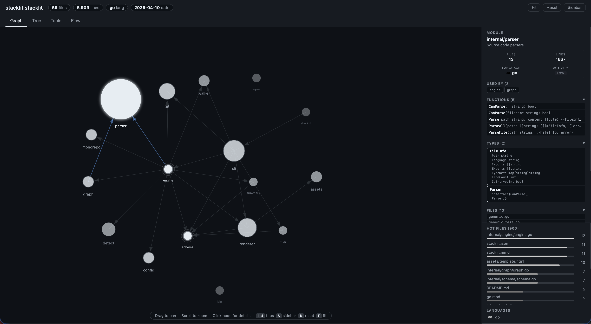

# Stacklit

**Your codebase, in 1,500 tokens.**

One command generates a committed JSON index that any AI agent can read. No server, no setup.

[](https://github.com/glincker/stacklit/actions)
[](https://github.com/glincker/stacklit/releases)
[](https://opensource.org/licenses/MIT)
[](https://www.npmjs.com/package/stacklit)

---

AI coding agents burn most of their context window just figuring out where things live. Reading one 2,000-line file to find a function signature costs ~6,000 tokens. Five agents on the same repo each rebuild the same mental model from scratch. Every session starts at zero.

`stacklit init` generates a `stacklit.json` that maps your entire codebase in ~1,500 tokens -- modules, dependencies, exports, types, what changed recently. Commit it to git. Now every agent that opens the repo already knows what goes where.

```bash
npx stacklit init
```


**Without stacklit:** Agent reads 8-12 files to build context. ~400,000 tokens. 45 seconds before writing a line.

**With stacklit:** Agent reads `stacklit.json`. ~1,500 tokens. Knows every module, dependency, and convention instantly.

## What you get

| File | What it does | Committed? |
|------|-------------|------------|
| `stacklit.json` | Machine-readable codebase index | Yes |
| `stacklit.mmd` | Mermaid dependency diagram (renders on GitHub) | Yes |
| `stacklit.html` | Interactive visual map with 4 views | No (gitignored) |

## stacklit.json

```json
{
  "project": { "name": "my-app", "type": "monorepo" },
  "tech": { "primary_language": "typescript" },
  "modules": {
    "src/auth": {
      "purpose": "Authentication and session management",
      "files": 8,
      "lines": 1200,
      "exports": ["AuthProvider", "useSession", "loginAction"],
      "depends_on": ["src/db", "src/config"],
      "activity": "high"
    }
  },
  "hints": {
    "add_feature": "Create handler in src/api/, add route in src/index.ts",
    "test_command": "npm test"
  }
}
```

A 500-file repo produces ~1,500 tokens of index. That is what an agent wastes reading ONE large file today.

## Visual map

`stacklit view` opens an interactive HTML with four tabs:



- **Graph** -- Force-directed dependency map. Click a node to see its exports, types, and files.
- **Tree** -- Collapsible directory hierarchy with file and line counts.
- **Table** -- Sortable module table. Find where the complexity lives.
- **Flow** -- Top-down dependency flow from entrypoints to leaf modules.

Self-contained HTML. Works offline. No CDN, no framework.

## MCP server

Stacklit includes an MCP server so AI agents can query your codebase index directly.

```bash
stacklit serve
```

Six tools: `get_overview`, `get_module`, `find_module`, `get_dependencies`, `get_hot_files`, `get_hints`.

### Claude Desktop / Claude Code

Add to your MCP config:

```json
{
  "mcpServers": {
    "stacklit": {
      "command": "stacklit",
      "args": ["serve"]
    }
  }
}
```

### Cursor

Add to `.cursor/mcp.json`:

```json
{
  "mcpServers": {
    "stacklit": {
      "command": "stacklit",
      "args": ["serve"]
    }
  }
}
```

The agent calls `get_overview()` once instead of reading 10 files to build context.

## Install

### npm (recommended)

```bash
npx stacklit init          # run directly
npm install -g stacklit    # or install globally
```

### Go

```bash
go install github.com/glincker/stacklit/cmd/stacklit@latest
```

### From source

```bash
git clone https://github.com/glincker/stacklit.git
cd stacklit && make build
```

### Binary releases

Download from [GitHub Releases](https://github.com/glincker/stacklit/releases). Binaries available for macOS (arm64, amd64), Linux (amd64, arm64), and Windows.

## CLI

```
stacklit init                    # scan, generate all outputs, open HTML
stacklit init --hook             # also install git post-commit hook
stacklit init --multi repos.txt  # polyrepo: scan multiple repos

stacklit generate                # regenerate from current source
stacklit generate --quiet        # silent mode for hooks/CI

stacklit view                    # regenerate HTML and open in browser
stacklit diff                    # check if index is stale (Merkle hash)
stacklit serve                   # start MCP server (stdio)
```

## Agent integration

### Claude Code

Add to `CLAUDE.md`:

```markdown
## Codebase index
Read stacklit.json before exploring files. Use modules to locate code, hints for conventions.
```

### Cursor / Copilot

Add to `.cursorrules` or `.github/copilot-instructions.md`:

```
Read stacklit.json first to understand codebase structure before exploring files.
```

### Any agent

`stacklit.json` is a plain JSON file. Any agent that reads files can use it without special integration.

## Language support

| Language | Parser | What it extracts |
|----------|--------|------------------|
| Go | stdlib AST (`go/parser`) | imports, exports, types, struct fields |
| TypeScript / JavaScript | Regex | imports, exports, framework detection |
| Python | Regex | imports, classes, functions, entrypoints |
| Rust | Regex | use statements, pub items |
| Java | Regex | imports, public classes/methods |
| Generic fallback | Line count | file count per module |

Tree-sitter parsers are planned for more accurate extraction across all languages.

## Monorepo support

Stacklit auto-detects workspace layouts:

- pnpm, npm, yarn workspaces
- Go workspaces (`go.work`)
- Turborepo, Nx, Lerna
- Cargo workspaces
- Convention directories (`apps/`, `packages/`, `services/`)

## Git integration

### Post-commit hook

```bash
stacklit init --hook
```

Auto-regenerates `stacklit.json` and `stacklit.mmd` on commit. Merkle hashing skips regeneration when only docs or configs changed.

### GitHub Action

```yaml
name: Update stacklit index
on:
  push:
    branches: [main]
    paths-ignore: ['stacklit.json', 'stacklit.mmd', '**.md']

jobs:
  stacklit:
    runs-on: ubuntu-latest
    steps:
      - uses: actions/checkout@v4
      - uses: actions/setup-go@v5
        with:
          go-version: '1.25'
      - run: go install github.com/glincker/stacklit/cmd/stacklit@latest
      - run: stacklit generate --quiet
      - uses: stefanzweifel/git-auto-commit-action@v5
        with:
          commit_message: "chore: update stacklit index"
          file_pattern: "stacklit.json stacklit.mmd"
```

## Configuration

Create a `stacklit.toml` in your project root to customize behavior:

```toml
# Extra paths to ignore (on top of .gitignore)
ignore = ["vendor/", "generated/"]

# Module detection depth (default: 4)
max_depth = 3

# Output file paths
[output]
json = "stacklit.json"
mermaid = "stacklit.mmd"
html = "stacklit.html"
```

## How it works

1. **Walk** -- Find source files, respect `.gitignore` + built-in skip list
2. **Parse** -- Extract imports, exports, types per file (Go AST, regex for others)
3. **Graph** -- Group files into modules by directory, resolve dependencies
4. **Detect** -- Identify monorepo structure, frameworks, entrypoints, env vars
5. **Git** -- Analyze 90-day commit history for file activity heatmap
6. **Render** -- Write JSON, Mermaid, and HTML outputs

Runs in under 100ms for most repos. Under 7 seconds for 20,000+ file repos.

## Compared to alternatives

| | Stacklit | Repomix | Aider repo-map | Codebase Memory MCP |
|---|---|---|---|---|
| Output | ~1,500 token JSON | 500k+ token dump | Ephemeral text | SQLite DB |
| Committed to repo | Yes | Too large | No | No |
| Dependency graph | Yes | No | Yes | Yes |
| Visual output | HTML (4 views) | No | No | No |
| MCP server | Yes | No | No | Yes |
| Monorepo aware | Yes | No | No | No |
| Runtime needed | No | No | Yes (Python) | Yes (C server) |
| Single binary | Yes (Go) | No (Node) | No (Python) | Yes (C) |

## Contributing

PRs welcome. The codebase is straightforward Go with two external deps (cobra, go-gitignore).

```bash
make build   # build binary
make test    # run all tests
```

## License

MIT
