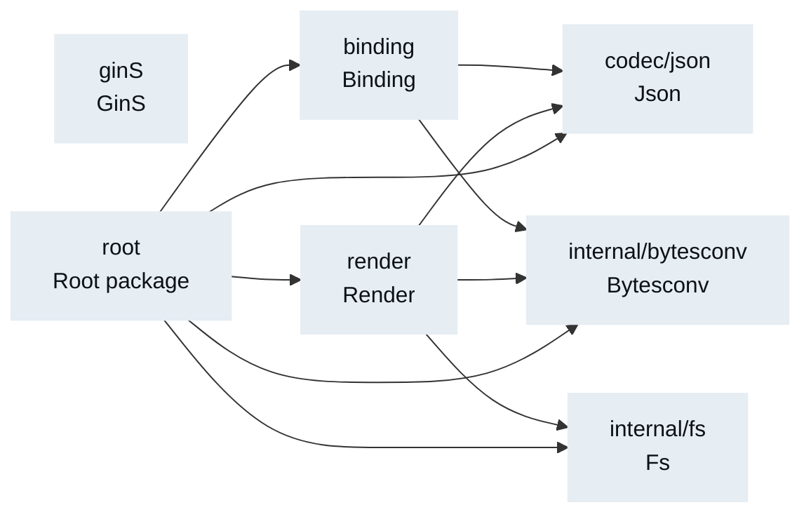

# stacklit-gin dependency graph

> Generated by [stacklit](https://github.com/glincker/stacklit) on 2026-04-10. Run `stacklit generate` to update.

```mermaid
graph LR
  classDef go fill:#e6edf3,color:#0d1117,stroke:#e6edf3
  ginS["ginS<br/>GinS"]:::go
  internal_bytesconv["internal/bytesconv<br/>Bytesconv"]:::go
  internal_fs["internal/fs<br/>Fs"]:::go
  render["render<br/>Render"]:::go
  root["root<br/>Root package"]:::go
  binding["binding<br/>Binding"]:::go
  codec_json["codec/json<br/>Json"]:::go
  binding --> codec_json
  binding --> internal_bytesconv
  render --> codec_json
  render --> internal_bytesconv
  render --> internal_fs
  root --> binding
  root --> codec_json
  root --> internal_bytesconv
  root --> internal_fs
  root --> render
```
